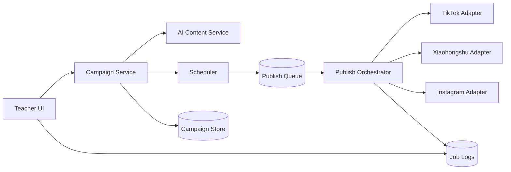
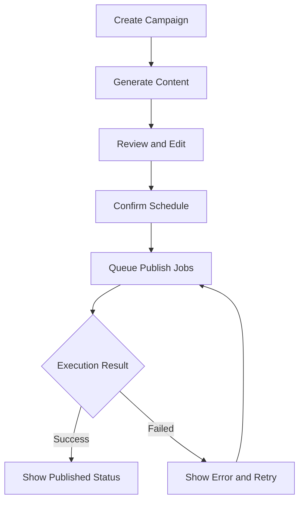
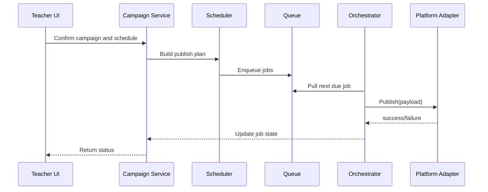

# US3 Design Specification

Owner: Zhenchao  
Version: v1.0  
Date: 2026-02-07

## 1. Design Objective

Provide a modular social publishing pipeline that can:

1. generate campaign content from concert data,
2. schedule platform jobs,
3. publish through platform adapters,
4. expose reliable status for teacher operations.

## 2. System Context



## 3. Core Components

| Component | Responsibility |
| --- | --- |
| Campaign Service | Create/update campaigns and timeline metadata. |
| AI Content Service | Generate flyer copy and platform caption variants. |
| Scheduler | Convert campaign timeline into concrete publish jobs. |
| Publish Orchestrator | Pull queued jobs, invoke platform adapters, update status. |
| Platform Adapter | Channel-specific payload mapping and publish execution. |
| Status/Logs API | Return job result, failure reason, and retry endpoint. |

## 4. Data Model (MVP)

## 4.1 Campaign

| Field | Type | Notes |
| --- | --- | --- |
| `campaign_id` | string | Primary key |
| `teacher_id` | string | Owner |
| `concert_title` | string | Required |
| `concert_datetime` | datetime | Required |
| `venue_or_link` | string | Required |
| `student_highlights` | string | Optional |
| `cta_link` | string | Optional |
| `status` | enum | `draft`, `scheduled`, `active`, `completed` |

## 4.2 ContentAsset

| Field | Type | Notes |
| --- | --- | --- |
| `asset_id` | string | Primary key |
| `campaign_id` | string | FK |
| `asset_type` | enum | `flyer_text`, `caption` |
| `platform` | enum | `shared`, `tiktok`, `xiaohongshu`, `instagram` |
| `content` | text | Generated and editable |
| `version` | int | Revision tracking |

## 4.3 PublishJob

| Field | Type | Notes |
| --- | --- | --- |
| `job_id` | string | Primary key |
| `campaign_id` | string | FK |
| `platform` | enum | Required |
| `scheduled_at` | datetime | Planned publish time |
| `payload_ref` | string | Pointer to composed content |
| `state` | enum | `queued`, `running`, `success`, `failed` |
| `error_code` | string | Nullable |
| `error_message` | string | Nullable |
| `retry_count` | int | Default 0 |

## 5. User Flow (Teacher)



## 6. Sequence (Schedule to Publish)



## 7. API Draft (MVP)

| Method | Endpoint | Purpose |
| --- | --- | --- |
| `POST` | `/api/v1/campaigns` | Create campaign |
| `POST` | `/api/v1/campaigns/{id}/generate` | Generate flyer and captions |
| `PATCH` | `/api/v1/campaigns/{id}/content` | Edit generated content |
| `POST` | `/api/v1/campaigns/{id}/schedule` | Confirm schedule and enqueue jobs |
| `GET` | `/api/v1/campaigns/{id}/jobs` | Query publish job states |
| `POST` | `/api/v1/jobs/{job_id}/retry` | Retry failed publish job |

## 8. Adapter Contract

Each adapter implements the same interface:

```text
publish(content_payload, media_asset, credentials) -> PublishResult
```

`PublishResult` fields:

1. `state`: success or failed
2. `external_post_id`: platform post id when success
3. `error_code`: normalized internal error code
4. `error_message`: human-readable failure reason

## 9. Reliability and Error Handling

1. Use idempotency key per job to avoid duplicate posting.
2. Retries use exponential backoff for transient platform errors.
3. Permanent failures (invalid credentials, rejected media) stop retries and request manual action.
4. All transitions are persisted for audit and demo walkthrough.

## 10. Security Considerations

1. Store platform credentials in env/secret manager only.
2. Mask tokens and sensitive payload fragments in logs.
3. Restrict retry endpoint to campaign owner role.

## 11. Mapping to Current Codebase

| Current Module | Suggested Role in US3 |
| --- | --- |
| `src/uploader.py` | TikTok adapter baseline implementation |
| `src/main.py` | Entry point for local publish execution and smoke tests |
| `config/config.yaml` | Channel settings, scheduling defaults, feature flags |

This allows incremental expansion from one channel (TikTok) to three channels without rewriting the full pipeline.
