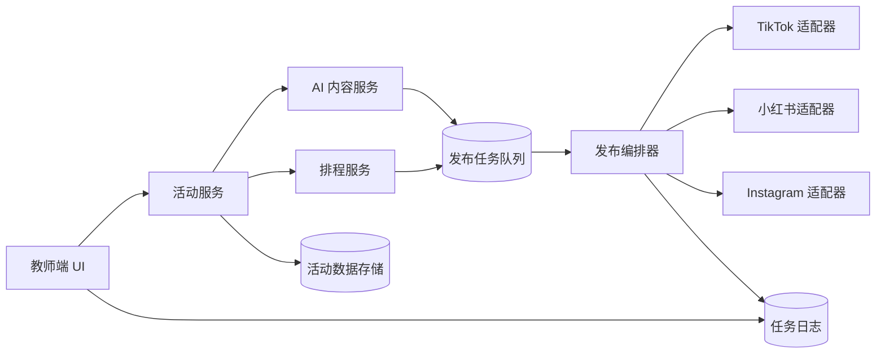
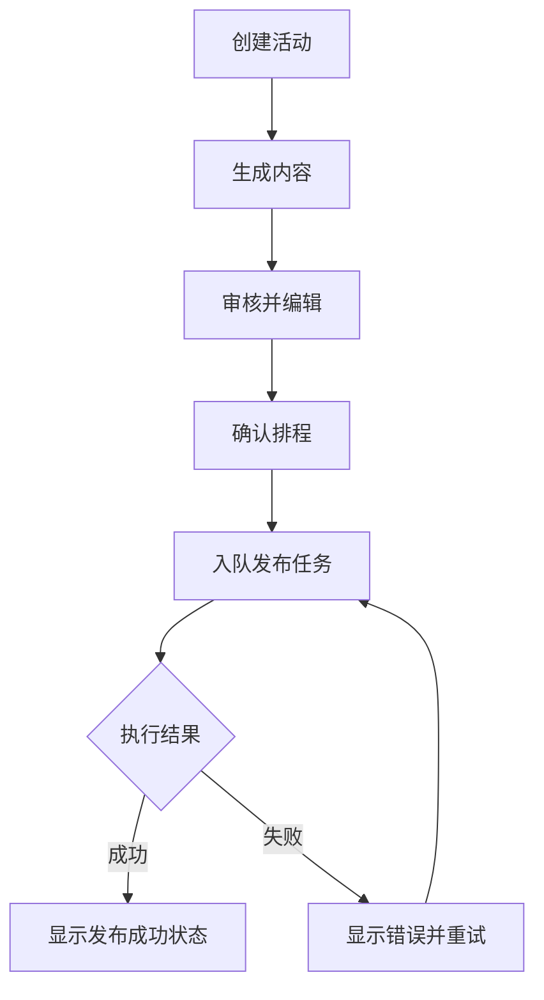
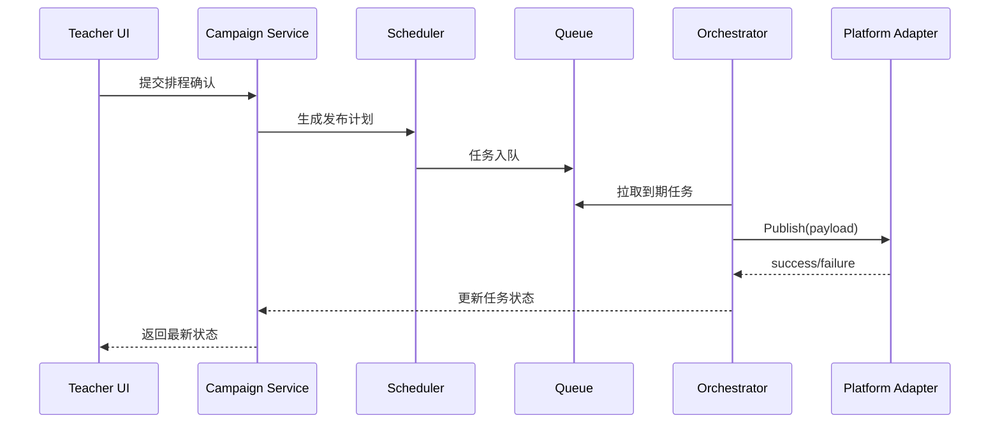

# US3 设计规格说明

负责人：Zhenchao  
版本：v1.0  
日期：2026-02-07

## 1. 设计目标

构建一个可扩展的社交发布流水线，实现以下能力：

1. 根据活动信息生成推广内容。
2. 按时间线生成并调度发布任务。
3. 通过平台适配器完成多平台发布。
4. 向教师提供可追踪的任务状态与错误信息。

## 2. 系统上下文



## 3. 核心模块

| 模块 | 职责 |
| --- | --- |
| 活动服务（Campaign Service） | 创建/更新活动及时间线信息。 |
| AI 内容服务（AI Content Service） | 生成海报文案和平台 caption。 |
| 排程服务（Scheduler） | 将活动时间线转换为发布任务。 |
| 发布编排器（Publish Orchestrator） | 拉取待执行任务并调用平台适配器，写回状态。 |
| 平台适配器（Platform Adapter） | 处理平台特定 payload 映射与发布执行。 |
| 状态/日志接口（Status API） | 返回任务结果、错误原因、重试入口。 |

## 4. 数据模型（MVP）

### 4.1 Campaign

| 字段 | 类型 | 说明 |
| --- | --- | --- |
| `campaign_id` | string | 主键 |
| `teacher_id` | string | 活动所有者 |
| `concert_title` | string | 必填 |
| `concert_datetime` | datetime | 必填 |
| `venue_or_link` | string | 必填 |
| `student_highlights` | string | 可选 |
| `cta_link` | string | 可选 |
| `status` | enum | `draft`、`scheduled`、`active`、`completed` |

### 4.2 ContentAsset

| 字段 | 类型 | 说明 |
| --- | --- | --- |
| `asset_id` | string | 主键 |
| `campaign_id` | string | 外键 |
| `asset_type` | enum | `flyer_text`、`caption` |
| `platform` | enum | `shared`、`tiktok`、`xiaohongshu`、`instagram` |
| `content` | text | 生成后可编辑 |
| `version` | int | 版本号 |

### 4.3 PublishJob

| 字段 | 类型 | 说明 |
| --- | --- | --- |
| `job_id` | string | 主键 |
| `campaign_id` | string | 外键 |
| `platform` | enum | 平台标识 |
| `scheduled_at` | datetime | 计划发布时间 |
| `payload_ref` | string | 内容引用 |
| `state` | enum | `queued`、`running`、`success`、`failed` |
| `error_code` | string | 可空 |
| `error_message` | string | 可空 |
| `retry_count` | int | 默认 0 |

## 5. 教师端用户流程



## 6. 时序流程（从排程到发布）



## 7. API 草案（MVP）

| 方法 | 路径 | 用途 |
| --- | --- | --- |
| `POST` | `/api/v1/campaigns` | 创建活动 |
| `POST` | `/api/v1/campaigns/{id}/generate` | 生成海报与 caption |
| `PATCH` | `/api/v1/campaigns/{id}/content` | 编辑生成内容 |
| `POST` | `/api/v1/campaigns/{id}/schedule` | 确认排程并入队 |
| `GET` | `/api/v1/campaigns/{id}/jobs` | 查询任务状态 |
| `POST` | `/api/v1/jobs/{job_id}/retry` | 重试失败任务 |

## 8. 适配器接口约定

每个平台适配器实现统一接口：

```text
publish(content_payload, media_asset, credentials) -> PublishResult
```

`PublishResult` 字段：

1. `state`: success / failed
2. `external_post_id`: 成功时的平台帖子 ID
3. `error_code`: 统一错误码
4. `error_message`: 可读错误原因

## 9. 可靠性与异常处理

1. 每个任务使用幂等键，防止重复发布。
2. 对瞬时错误使用指数退避重试策略。
3. 对永久错误（凭证失效、媒体不合规）停止自动重试并提示人工处理。
4. 全量记录状态迁移，支持演示和审计追踪。

## 10. 安全要求

1. 平台密钥仅存储在环境变量或密钥管理系统中。
2. 日志中屏蔽 token 与敏感字段。
3. 重试接口仅允许活动所有者或授权角色调用。

## 11. 与现有代码映射

| 现有模块 | 在 US3 中建议角色 |
| --- | --- |
| `src/uploader.py` | TikTok 适配器基础实现 |
| `src/main.py` | 本地执行入口和冒烟验证入口 |
| `config/config.yaml` | 平台配置、排程默认值、功能开关 |

这样可以在保留现有 TikTok 能力的前提下，增量扩展到三平台而不重写主流程。
